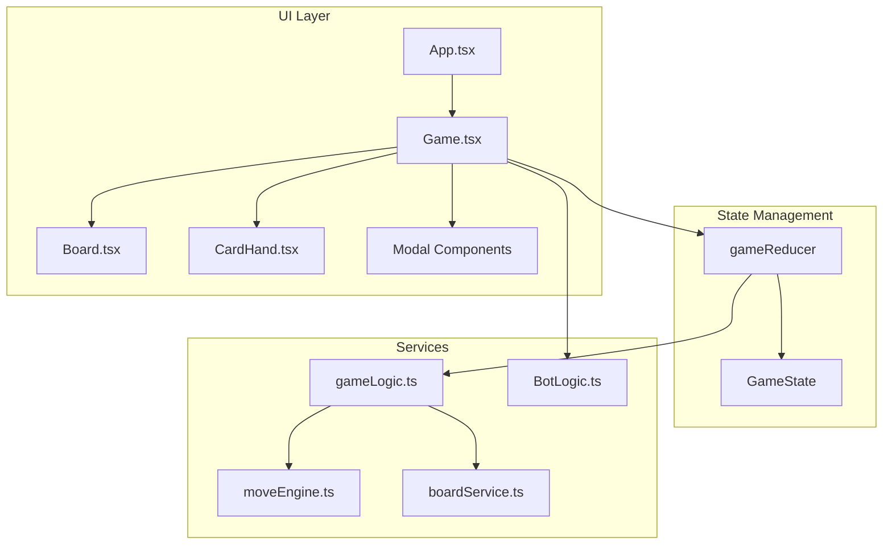
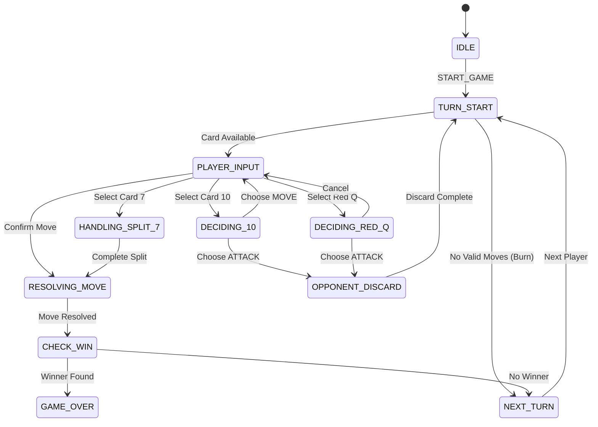

# Design Document: Jackaroo King 1v1

## Overview

Jackaroo King 是一款基于 React + TypeScript 的策略棋盘游戏。本设计文档描述了 1v1 模式的系统架构、核心组件、数据模型和游戏逻辑实现。

游戏采用有限状态机（FSM）模式管理游戏状态，使用 useReducer 进行状态管理，确保状态转换的可预测性和可测试性。

## Architecture

### 系统架构图



### 游戏状态机



## Components and Interfaces

### 核心组件

#### 1. Game Component
主游戏控制器，管理游戏状态和用户交互。

```typescript
interface GameProps {
  playerCount: number;
  onExit: () => void;
}

// 职责:
// - 初始化游戏状态
// - 处理用户输入事件
// - 协调 AI 回合
// - 管理 UI 状态（拖拽、悬停等）
```

#### 2. Board Component
棋盘渲染组件，显示轨道、棋子和交互区域。

```typescript
interface BoardProps {
  gameState: GameState;
  onMarbleClick: (marbleId: string) => void;
  onNodeClick: (nodeId: string) => void;
}

// 职责:
// - 渲染环形轨道节点
// - 渲染玩家基地和终点区域
// - 显示棋子位置
// - 高亮有效移动目标
```

#### 3. CardHand Component
手牌显示和交互组件。

```typescript
interface CardHandProps {
  player: Player;
  selectedCardId: string | null;
  shakingCardId: string | null;
  isDeadlocked: boolean;
  onCardSelect: (cardId: string) => void;
  onDragStart: () => void;
  onDragEnd: () => void;
  onHoverBurnZone: (isHovering: boolean) => void;
  onBurnCard: (cardId: string) => void;
}
```

### 服务层接口

#### 1. Move Engine
移动计算引擎，负责验证和执行移动。

```typescript
interface MoveEngine {
  calculateValidMoves(
    state: GameState, 
    player: Player, 
    card: Card, 
    marbleId: string | null,
    stepOverride?: number
  ): MoveCandidate[];
  
  executeMove(
    state: GameState, 
    move: MoveCandidate
  ): { nextState: GameState; events: MoveEvents };
}

interface MoveEvents {
  killedOpponent: boolean;
  enteredHome: boolean;
  killedMarbleIds: string[];
}
```

#### 2. Board Service
棋盘生成服务。

```typescript
interface BoardService {
  generateBoard(): Record<string, BoardNode>;
  getNodeAt(index: number): BoardNode;
  getHomePathNodes(color: PlayerColor): BoardNode[];
}
```

#### 3. Bot Logic
AI 决策逻辑。

```typescript
interface BotDecision {
  action: 'MOVE' | 'BURN';
  cardId: string;
  move?: MoveCandidate;
}

interface BotLogic {
  getBestMove(state: GameState, player: Player): BotDecision;
}
```

## Data Models

### 核心类型定义

```typescript
// 玩家颜色
type PlayerColor = 'red' | 'blue' | 'yellow' | 'green';

// 扑克牌花色和点数
type Suit = 'hearts' | 'diamonds' | 'clubs' | 'spades';
type Rank = 'A' | '2' | '3' | '4' | '5' | '6' | '7' | '8' | '9' | '10' | 'J' | 'Q' | 'K';

// 卡牌
interface Card {
  id: string;
  suit: Suit;
  rank: Rank;
  value: number;
}

// 玩家
interface Player {
  id: string;
  color: PlayerColor;
  team: number;
  hand: Card[];
  marbles: string[];
  isFinished: boolean;
  isBot: boolean;
}

// 棋子位置类型
type MarbleLocation = 'BASE' | 'HOME' | string; // string = NodeId

// 棋子
interface Marble {
  id: string;
  ownerId: string;
  color: PlayerColor;
  position: MarbleLocation;
  isSafe: boolean;
}

// 棋盘节点类型
type NodeType = 'normal' | 'start' | 'home_entrance' | 'home_path' | 'home';

// 棋盘节点
interface BoardNode {
  id: string;
  type: NodeType;
  next: string[];
  prev: string | null;
  isSafe: boolean;
  isStartFor?: PlayerColor;
  isHomeEntranceFor?: PlayerColor;
}
```

### 游戏状态

```typescript
interface GameState {
  // 核心数据
  players: Player[];
  marbles: Record<string, Marble>;
  board: Record<string, BoardNode>;
  deck: Card[];
  discardPile: Card[];
  
  // 回合控制
  currentPlayerIndex: number;
  currentRound: number;
  phase: GamePhase;
  
  // 选择上下文
  selectedCardId: string | null;
  selectedMarbleId: string | null;
  possibleMoves: MoveCandidate[];
  
  // 攻击状态
  pendingAttackerIndex: number | null;
  repeatTurn: boolean;
  
  // 分步移动状态
  split7State: {
    firstMoveUsed: number | null;
    firstMarbleId: string | null;
    remainingSteps: number;
  } | null;
  
  // 日志
  lastActionLog: string[];
}
```

### 移动候选

```typescript
type MoveType = 
  | 'standard'      // 标准前进/后退
  | 'base_exit'     // 从基地出来
  | 'swap'          // Jack 互换
  | 'kill_path'     // K 的路径击杀
  | 'split_move'    // 7 的分步移动
  | 'force_discard'; // 强制弃牌

interface MoveCandidate {
  type: MoveType;
  cardId: string;
  marbleId?: string;
  targetPosition?: string;
  swapTargetMarbleId?: string;
  stepsUsed?: number;
  killedMarbleIds?: string[];
  isValid: boolean;
}
```

## Correctness Properties

*A property is a characteristic or behavior that should hold true across all valid executions of a system-essentially, a formal statement about what the system should do. Properties serve as the bridge between human-readable specifications and machine-verifiable correctness guarantees.*

### Property 1: 棋子数量守恒
*For any* game state, the total number of marbles per player SHALL always equal 4, regardless of their positions (Base, Board, or Home).
**Validates: Requirements 1.2**

### Property 2: 发牌数量正确性
*For any* round number N, the number of cards dealt SHALL equal 5 if N mod 3 equals 0, otherwise 4.
**Validates: Requirements 2.2, 2.3**

### Property 3: 移动步数一致性
*For any* standard move with a number card, the distance between start and end positions SHALL equal the card's value (positive for forward, negative for card 4).
**Validates: Requirements 4.1, 4.2**

### Property 4: 7 分步总和
*For any* completed card 7 move (single or split), the total steps used SHALL equal exactly 7.
**Validates: Requirements 6.2**

### Property 5: 捕获后位置重置
*For any* captured marble, its position SHALL be 'BASE' immediately after capture.
**Validates: Requirements 9.1**

### Property 6: 连击奖励一致性
*For any* capture or home entry event, the acting player's hand size SHALL increase by 1 (if deck is non-empty) and they SHALL receive an extra turn.
**Validates: Requirements 10.1, 10.2**

### Property 7: 终点不可捕获
*For any* marble in Home_Area, no capture action SHALL affect its position.
**Validates: Requirements 9.5**

### Property 8: 胜利条件正确性
*For any* player with all 4 marbles in Home_Area positions, the game phase SHALL transition to GAME_OVER.
**Validates: Requirements 12.1**

### Property 9: 回合交替正确性
*For any* non-combo turn completion, the currentPlayerIndex SHALL change to the next player.
**Validates: Requirements 3.4**

### Property 10: 攻击回合返回
*For any* attack action (10 or Red Q), after opponent discards, the turn SHALL return to the attacker.
**Validates: Requirements 8.4**

## Error Handling

### 无效移动处理
- 选择无法移动的卡牌时，显示抖动动画提示
- 计算有效移动时过滤所有不合法的目标位置
- 分步移动时，若剩余步数无有效移动则自动结束

### 状态恢复
- 使用 FSM 确保状态转换的确定性
- 每个 action 都有明确的前置条件检查
- 取消操作可回退到上一个稳定状态

### 边界情况
- 牌堆耗尽时自动洗入弃牌堆
- 所有玩家手牌为空时触发新一轮发牌
- AI 无有效移动时自动弃牌

## Testing Strategy

### 单元测试
- 测试每种卡牌的移动计算逻辑
- 测试捕获机制的正确性
- 测试发牌规则的正确性
- 测试胜利条件检测

### 属性测试 (Property-Based Testing)
使用 fast-check 库进行属性测试：
- 生成随机游戏状态验证不变量
- 生成随机移动序列验证状态一致性
- 最少 100 次迭代验证每个属性

### 集成测试
- 测试完整游戏流程
- 测试 AI 决策逻辑
- 测试 UI 交互响应

### 测试标注格式
每个属性测试需标注：
**Feature: jackaroo-1v1, Property {number}: {property_text}**
