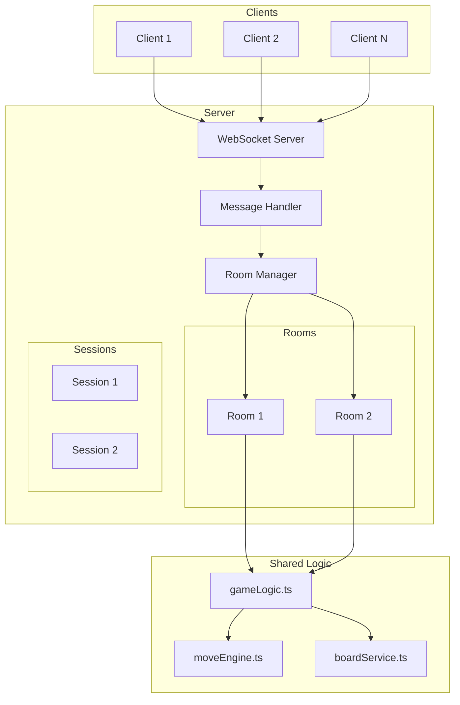

# Design Document: Jackaroo Node.js Game Server

## Overview

本设计文档描述了 Jackaroo 游戏 Node.js 服务端的架构设计。核心策略是将现有客户端的游戏逻辑提取为共享模块，服务端复用这些逻辑来保证游戏规则的一致性。

服务端采用 WebSocket 实现实时通信，使用房间（Room）概念管理多局并发游戏。

## Architecture

```
┌─────────────────────────────────────────────────────────────┐
│                      Project Structure                       │
├─────────────────────────────────────────────────────────────┤
│  jackaroo/                                                   │
│  ├── shared/                 # 共享游戏逻辑（客户端+服务端）  │
│  │   ├── types.ts                                           │
│  │   ├── constants.ts                                       │
│  │   ├── gameLogic.ts                                       │
│  │   ├── moveEngine.ts                                      │
│  │   └── boardService.ts                                    │
│  │                                                          │
│  ├── client/                 # 现有客户端代码                │
│  │   ├── components/                                        │
│  │   ├── services/           # 仅保留 UI 相关服务           │
│  │   └── ...                                                │
│  │                                                          │
│  └── server/                 # 新增服务端代码                │
│      ├── index.ts            # 入口                         │
│      ├── WebSocketServer.ts  # WebSocket 服务               │
│      ├── RoomManager.ts      # 房间管理                     │
│      ├── Room.ts             # 单个房间实例                 │
│      ├── PlayerSession.ts    # 玩家会话                     │
│      ├── MessageHandler.ts   # 消息处理                     │
│      └── protocol.ts         # 消息协议定义                 │
└─────────────────────────────────────────────────────────────┘
```

### 架构图



## Components and Interfaces

### 1. Shared Logic Module (`shared/`)

从现有客户端提取的核心游戏逻辑，需要做以下修改：

```typescript
// shared/types.ts - 保持不变，直接复用

// shared/constants.ts - 保持不变，直接复用

// shared/gameLogic.ts - 需要修改
// 1. 移除 generateId 的 Math.random 实现
// 2. 注入 ID 生成器和随机数生成器

export interface GameLogicConfig {
  generateId: () => string;
  shuffleArray: <T>(arr: T[]) => T[];
}

export const createGameLogic = (config: GameLogicConfig) => {
  const createDeck = (): Card[] => {
    const deck: Card[] = [];
    SUITS.forEach(suit => {
      RANKS.forEach(rank => {
        deck.push({
          id: config.generateId(),
          suit,
          rank,
          value: 0
        });
      });
    });
    return config.shuffleArray(deck);
  };
  
  // ... 其余逻辑保持不变
  return { createInitialState, gameReducer, enhancedGameReducer };
};
```

### 2. WebSocket Server (`server/WebSocketServer.ts`)

```typescript
import { WebSocketServer as WSServer, WebSocket } from 'ws';
import { PlayerSession } from './PlayerSession';
import { MessageHandler } from './MessageHandler';

export interface WebSocketServerConfig {
  port: number;
  maxConnections: number;
}

export class WebSocketServer {
  private wss: WSServer;
  private sessions: Map<string, PlayerSession>;
  private messageHandler: MessageHandler;
  
  constructor(config: WebSocketServerConfig);
  
  start(): void;
  stop(): void;
  
  // 连接管理
  handleConnection(ws: WebSocket): void;
  handleDisconnection(sessionId: string): void;
  handleReconnection(sessionId: string, ws: WebSocket): void;
  
  // 消息发送
  sendToSession(sessionId: string, message: ServerMessage): void;
  broadcastToRoom(roomId: string, message: ServerMessage): void;
}
```

### 3. Room Manager (`server/RoomManager.ts`)

```typescript
import { Room } from './Room';
import { PlayerSession } from './PlayerSession';

export class RoomManager {
  private rooms: Map<string, Room>;
  
  constructor();
  
  // 房间操作
  createRoom(creatorSession: PlayerSession, playerCount: 2 | 4): Room;
  joinRoom(roomCode: string, session: PlayerSession): Room | null;
  leaveRoom(roomCode: string, sessionId: string): void;
  
  // 查询
  getRoom(roomCode: string): Room | null;
  getRoomBySessionId(sessionId: string): Room | null;
  
  // 清理
  cleanupEmptyRooms(): void;
  
  // 房间码生成
  private generateRoomCode(): string;
}
```

### 4. Room (`server/Room.ts`)

```typescript
import { GameState, GameAction } from '../shared/types';
import { createGameLogic } from '../shared/gameLogic';
import { PlayerSession } from './PlayerSession';

export type RoomStatus = 'waiting' | 'playing' | 'finished';

export interface RoomConfig {
  maxPlayers: 2 | 4;
  roomCode: string;
}

export class Room {
  readonly roomCode: string;
  readonly maxPlayers: 2 | 4;
  
  private status: RoomStatus;
  private players: Map<string, PlayerSession>;
  private gameState: GameState | null;
  private gameLogic: ReturnType<typeof createGameLogic>;
  
  constructor(config: RoomConfig);
  
  // 玩家管理
  addPlayer(session: PlayerSession): boolean;
  removePlayer(sessionId: string): void;
  getPlayers(): PlayerSession[];
  isFull(): boolean;
  isEmpty(): boolean;
  
  // 游戏控制
  startGame(): GameState;
  processAction(sessionId: string, action: GameAction): GameState | null;
  
  // 状态查询
  getStatus(): RoomStatus;
  getGameState(): GameState | null;
  getStateForPlayer(sessionId: string): GameState;  // 隐藏其他玩家手牌
  
  // 玩家映射
  getPlayerIndexBySessionId(sessionId: string): number;
  isCurrentPlayer(sessionId: string): boolean;
}
```

### 5. Player Session (`server/PlayerSession.ts`)

```typescript
import { WebSocket } from 'ws';

export type SessionStatus = 'connected' | 'disconnected' | 'reconnecting';

export class PlayerSession {
  readonly sessionId: string;
  
  private ws: WebSocket | null;
  private status: SessionStatus;
  private roomCode: string | null;
  private playerIndex: number | null;
  private disconnectedAt: number | null;
  
  constructor(sessionId: string, ws: WebSocket);
  
  // 连接管理
  setWebSocket(ws: WebSocket): void;
  disconnect(): void;
  reconnect(ws: WebSocket): void;
  isConnected(): boolean;
  canReconnect(): boolean;  // 检查是否在 60 秒内
  
  // 房间关联
  setRoom(roomCode: string, playerIndex: number): void;
  clearRoom(): void;
  getRoomCode(): string | null;
  getPlayerIndex(): number | null;
  
  // 消息发送
  send(message: ServerMessage): void;
}
```

### 6. Message Handler (`server/MessageHandler.ts`)

```typescript
import { RoomManager } from './RoomManager';
import { PlayerSession } from './PlayerSession';
import { ClientMessage, ServerMessage } from './protocol';

export class MessageHandler {
  private roomManager: RoomManager;
  
  constructor(roomManager: RoomManager);
  
  // 消息处理入口
  handleMessage(session: PlayerSession, rawMessage: string): void;
  
  // 具体消息处理
  private handleCreateRoom(session: PlayerSession, msg: CreateRoomMessage): void;
  private handleJoinRoom(session: PlayerSession, msg: JoinRoomMessage): void;
  private handleLeaveRoom(session: PlayerSession): void;
  private handleGameAction(session: PlayerSession, msg: GameActionMessage): void;
  
  // 验证
  private validateMessage(rawMessage: string): ClientMessage | null;
  private validateGameAction(session: PlayerSession, action: GameAction): boolean;
}
```

### 7. Protocol (`server/protocol.ts`)

```typescript
import { GameState, GameAction } from '../shared/types';

// 客户端 -> 服务端
export type ClientMessageType = 
  | 'CREATE_ROOM'
  | 'JOIN_ROOM'
  | 'LEAVE_ROOM'
  | 'GAME_ACTION'
  | 'PING';

export interface CreateRoomMessage {
  type: 'CREATE_ROOM';
  playerCount: 2 | 4;
}

export interface JoinRoomMessage {
  type: 'JOIN_ROOM';
  roomCode: string;
}

export interface LeaveRoomMessage {
  type: 'LEAVE_ROOM';
}

export interface GameActionMessage {
  type: 'GAME_ACTION';
  action: GameAction;
}

export interface PingMessage {
  type: 'PING';
}

export type ClientMessage = 
  | CreateRoomMessage 
  | JoinRoomMessage 
  | LeaveRoomMessage 
  | GameActionMessage
  | PingMessage;

// 服务端 -> 客户端
export type ServerMessageType =
  | 'ROOM_CREATED'
  | 'ROOM_JOINED'
  | 'PLAYER_JOINED'
  | 'PLAYER_LEFT'
  | 'GAME_STARTED'
  | 'STATE_UPDATE'
  | 'ERROR'
  | 'PONG';

export interface RoomCreatedMessage {
  type: 'ROOM_CREATED';
  roomCode: string;
  playerIndex: number;
}

export interface RoomJoinedMessage {
  type: 'ROOM_JOINED';
  roomCode: string;
  playerIndex: number;
  players: { index: number; connected: boolean }[];
}

export interface PlayerJoinedMessage {
  type: 'PLAYER_JOINED';
  playerIndex: number;
}

export interface PlayerLeftMessage {
  type: 'PLAYER_LEFT';
  playerIndex: number;
}

export interface GameStartedMessage {
  type: 'GAME_STARTED';
  state: GameState;  // 已过滤的状态
}

export interface StateUpdateMessage {
  type: 'STATE_UPDATE';
  state: GameState;  // 已过滤的状态
}

export interface ErrorMessage {
  type: 'ERROR';
  code: string;
  message: string;
}

export interface PongMessage {
  type: 'PONG';
}

export type ServerMessage =
  | RoomCreatedMessage
  | RoomJoinedMessage
  | PlayerJoinedMessage
  | PlayerLeftMessage
  | GameStartedMessage
  | StateUpdateMessage
  | ErrorMessage
  | PongMessage;
```

## Data Models

### GameState 过滤

服务端发送给客户端的 GameState 需要隐藏其他玩家的手牌：

```typescript
export const filterStateForPlayer = (
  state: GameState, 
  playerIndex: number
): GameState => {
  const filteredPlayers = state.players.map((player, index) => {
    if (index === playerIndex) {
      return player;  // 自己的手牌完整显示
    }
    return {
      ...player,
      hand: player.hand.map(card => ({
        ...card,
        suit: 'hidden' as any,  // 隐藏花色
        rank: 'hidden' as any,  // 隐藏点数
      }))
    };
  });
  
  return {
    ...state,
    players: filteredPlayers,
    deck: [],  // 隐藏牌堆
  };
};
```

### 房间状态

```typescript
interface RoomState {
  roomCode: string;
  status: 'waiting' | 'playing' | 'finished';
  maxPlayers: 2 | 4;
  players: {
    sessionId: string;
    playerIndex: number;
    connected: boolean;
  }[];
  createdAt: number;
  lastActivityAt: number;
}
```

## Correctness Properties

*A property is a characteristic or behavior that should hold true across all valid executions of a system—essentially, a formal statement about what the system should do. Properties serve as the bridge between human-readable specifications and machine-verifiable correctness guarantees.*

### Property 1: Session Lifecycle Consistency

*For any* WebSocket connection event (connect, disconnect, reconnect), the PlayerSession state SHALL correctly reflect the connection status, and reconnection within 60 seconds SHALL restore the previous session state.

**Validates: Requirements 2.1, 2.2, 2.3**

### Property 2: Room Code Uniqueness

*For any* sequence of room creation requests, all generated room codes SHALL be unique.

**Validates: Requirements 3.1**

### Property 3: Room Capacity Enforcement

*For any* room with a configured player count (2 or 4), the room SHALL accept exactly that many players and reject all subsequent join requests.

**Validates: Requirements 3.2, 3.3, 3.6**

### Property 4: State Broadcast Consistency

*For any* valid game action processed by the server, all connected players in the room SHALL receive a state update, and the state SHALL be consistent with the shared logic reducer output.

**Validates: Requirements 4.1, 4.2**

### Property 5: Turn Validation

*For any* game action received from a player who is not the current turn player, the server SHALL reject the action and return an error.

**Validates: Requirements 4.3, 4.4**

### Property 6: Hand Privacy

*For any* GameState sent to a player, the hands of all other players SHALL be hidden (masked), while the receiving player's own hand SHALL be fully visible.

**Validates: Requirements 4.5**

### Property 7: Action Validation and Processing

*For any* game action (SELECT_CARD, SELECT_MARBLE, CONFIRM_MOVE, BURN_CARD), the server SHALL validate ownership/legality and process valid actions using the shared logic reducer.

**Validates: Requirements 5.1, 5.2, 5.3, 5.4**

### Property 8: Message Protocol Compliance

*For any* message sent by the server, it SHALL be valid JSON with a type field. *For any* message received by the server, it SHALL be validated against the protocol schema.

**Validates: Requirements 6.1, 6.2, 6.3**

### Property 9: Malformed Message Handling

*For any* malformed or invalid message received by the server, an error response SHALL be sent to the client.

**Validates: Requirements 6.5**

### Property 10: Error Resilience

*For any* unexpected error during message processing, the server SHALL catch the error, log it, and continue operating without crashing.

**Validates: Requirements 7.1**

### Property 11: Rate Limiting

*For any* player sending requests exceeding the rate limit threshold, subsequent requests SHALL be rejected until the rate limit window resets.

**Validates: Requirements 7.4**

## Error Handling

### Connection Errors

```typescript
// WebSocket 连接错误处理
ws.on('error', (error) => {
  logger.error('WebSocket error', { sessionId, error: error.message });
  session.disconnect();
  cleanupSession(sessionId);
});
```

### Message Processing Errors

```typescript
// 消息处理错误
try {
  const message = JSON.parse(rawMessage);
  await handleMessage(session, message);
} catch (error) {
  if (error instanceof SyntaxError) {
    session.send({ type: 'ERROR', code: 'INVALID_JSON', message: 'Invalid JSON format' });
  } else if (error instanceof ValidationError) {
    session.send({ type: 'ERROR', code: 'VALIDATION_ERROR', message: error.message });
  } else {
    logger.error('Unexpected error', { sessionId, error });
    session.send({ type: 'ERROR', code: 'INTERNAL_ERROR', message: 'Internal server error' });
  }
}
```

### Game Action Errors

| Error Code | Description | Trigger |
|------------|-------------|---------|
| `NOT_YOUR_TURN` | 不是该玩家的回合 | 非当前玩家发送动作 |
| `INVALID_CARD` | 无效的卡牌选择 | 选择不属于自己的卡牌 |
| `INVALID_MARBLE` | 无效的弹珠选择 | 选择不合法的弹珠 |
| `INVALID_MOVE` | 无效的移动 | 移动不符合游戏规则 |
| `ROOM_FULL` | 房间已满 | 尝试加入满员房间 |
| `ROOM_NOT_FOUND` | 房间不存在 | 使用无效房间码 |
| `GAME_NOT_STARTED` | 游戏未开始 | 在等待状态发送游戏动作 |

## Testing Strategy

### 测试框架选择

- **单元测试**: Jest
- **属性测试**: fast-check
- **WebSocket 测试**: ws + mock-socket

### 单元测试

单元测试用于验证具体示例和边界情况：

```typescript
// 示例：房间创建测试
describe('RoomManager', () => {
  it('should create a room with unique code', () => {
    const manager = new RoomManager();
    const room = manager.createRoom(mockSession, 2);
    expect(room.roomCode).toHaveLength(6);
  });
  
  it('should reject join when room is full', () => {
    const manager = new RoomManager();
    const room = manager.createRoom(mockSession1, 2);
    manager.joinRoom(room.roomCode, mockSession2);
    const result = manager.joinRoom(room.roomCode, mockSession3);
    expect(result).toBeNull();
  });
});
```

### 属性测试

属性测试用于验证普遍性质，每个测试至少运行 100 次迭代：

```typescript
import * as fc from 'fast-check';

// Feature: nodejs-game-server, Property 2: Room Code Uniqueness
describe('Property: Room Code Uniqueness', () => {
  it('all generated room codes should be unique', () => {
    fc.assert(
      fc.property(
        fc.integer({ min: 10, max: 100 }),
        (roomCount) => {
          const manager = new RoomManager();
          const codes = new Set<string>();
          
          for (let i = 0; i < roomCount; i++) {
            const room = manager.createRoom(createMockSession(), 2);
            codes.add(room.roomCode);
          }
          
          return codes.size === roomCount;
        }
      ),
      { numRuns: 100 }
    );
  });
});

// Feature: nodejs-game-server, Property 6: Hand Privacy
describe('Property: Hand Privacy', () => {
  it('other players hands should be hidden in filtered state', () => {
    fc.assert(
      fc.property(
        fc.integer({ min: 0, max: 3 }),
        fc.integer({ min: 2, max: 4 }),
        (playerIndex, playerCount) => {
          if (playerIndex >= playerCount) return true;
          
          const state = createInitialState(playerCount);
          const filtered = filterStateForPlayer(state, playerIndex);
          
          return filtered.players.every((player, idx) => {
            if (idx === playerIndex) {
              // Own hand should be visible
              return player.hand.every(card => 
                card.suit !== 'hidden' && card.rank !== 'hidden'
              );
            } else {
              // Other hands should be hidden
              return player.hand.every(card => 
                card.suit === 'hidden' && card.rank === 'hidden'
              );
            }
          });
        }
      ),
      { numRuns: 100 }
    );
  });
});
```

### 测试覆盖要求

| 类型 | 覆盖目标 |
|------|----------|
| 单元测试 | 具体示例、边界情况、错误条件 |
| 属性测试 | 所有正确性属性（Property 1-11） |
| 集成测试 | WebSocket 连接流程、完整游戏流程 |

### 测试文件结构

```
server/
├── __tests__/
│   ├── unit/
│   │   ├── RoomManager.test.ts
│   │   ├── Room.test.ts
│   │   ├── PlayerSession.test.ts
│   │   └── MessageHandler.test.ts
│   ├── property/
│   │   ├── roomCodeUniqueness.property.ts
│   │   ├── handPrivacy.property.ts
│   │   ├── turnValidation.property.ts
│   │   └── ...
│   └── integration/
│       ├── websocket.integration.ts
│       └── gameFlow.integration.ts
```

